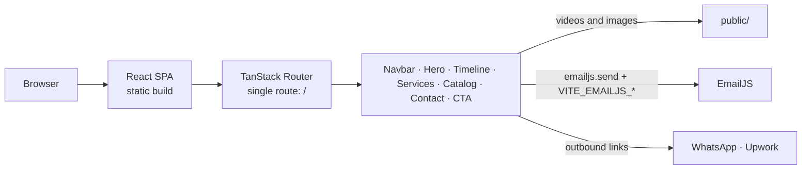

# Project Manager Portfolio

Single-page consulting website for Yasser Maamoun, a project manager: a scroll-driven career timeline, priced consulting services, a catalog of deliverables, and a contact form for prospective clients.

[Live Site](https://yassermaamoun.com)

## Overview

The site positions a project-management and strategy consultant with more than 20 years of experience. A visitor sees a hero with a portrait and headline, then a career timeline in which the role nearest the center of the screen expands to show a video, followed by three monthly-priced service offerings, a six-item catalog of deliverables, and a contact section.

It is a static front end with no backend of its own. Its only outbound request is the contact form, which sends through EmailJS directly from the browser.

## Key Features

- **Hero**: portrait with a diagonal clip on desktop and a headline about the consultant's experience.
- **Career timeline**: five roles from 1999 to the present. As the visitor scrolls, the entry closest to the viewport center becomes active: its marker enlarges and its video expands.
- **Services**: three offerings shown as cards with monthly prices (Project Strategy & Planning, Program & Portfolio Management, Executive Advisory & Risk Management).
- **Catalog**: six deliverables (feasibility study, loans and deposits consultancy, risk management, business plan, business analysis, go-to-market strategy), each with an image and description.
- **Contact**: WhatsApp and Upwork links, plus a collapsible email form with per-field validation and success/error feedback.
- **Sharing metadata**: title, description, Open Graph and Twitter card tags in `index.html`, and a web app manifest.

## Tech Stack

| Area | Tools |
| --- | --- |
| UI | React 19, TypeScript (strict mode) |
| Routing | TanStack Router with file-based routes and automatic code splitting |
| Styling | Tailwind CSS 4 plus a small amount of custom CSS (`src/styles.css`) |
| Icons | lucide-react |
| Contact form | EmailJS (`@emailjs/browser`) |
| Build | Vite 7 |
| Testing | Vitest and Testing Library are installed; no tests exist |

## Architecture



`vite build` produces static files in `dist/`, so no server is required. The router has one route (`/`), defined in `src/routes/index.tsx`, which composes the sections in this order: `Navbar`, `Hero`, `ExperienceTimeline`, `Services`, `Catalog`, `Contact`, `FinalCTA`. `src/routes/__root.tsx` renders the route outlet and mounts the TanStack devtools.

## Project Structure

```text
.
├── index.html               Title, description, Open Graph and Twitter tags, manifest link
├── public/                  Portrait, catalog images, timeline videos, manifest, robots.txt
├── src/
│   ├── main.tsx             Entry point, router creation
│   ├── routes/
│   │   ├── __root.tsx       Root layout and router devtools
│   │   └── index.tsx        The single page, composes the sections
│   ├── components/
│   │   ├── Navbar.tsx           Fixed top navigation with anchor links
│   │   ├── Hero.tsx             Portrait and headline
│   │   ├── ExperinceTimeline.tsx  Career timeline with scroll-driven video
│   │   ├── Services.tsx         Priced service cards
│   │   ├── Catalog.tsx          Deliverables grid
│   │   ├── Contacts.tsx         Contact links and EmailJS form
│   │   └── FinalCta.tsx         Closing call to action
│   ├── routeTree.gen.ts     Generated by the TanStack Router plugin
│   └── styles.css
├── .env.example             EmailJS variable names
├── vite.config.ts
└── tsconfig.json
```

## Engineering Notes

### Timeline follows the viewport center

`ExperinceTimeline.tsx` registers a passive `scroll` listener that measures each entry's center against the viewport center with `getBoundingClientRect()` and stores the closest index in state. That one index drives the marker style and whether an entry's video container is expanded (`max-h-[400px]`) or collapsed. The trade-off: the calculation runs on every scroll event, and every entry's `<video>` element is mounted from the start (with `autoPlay`, `muted`, `loop`), only visually collapsed. Inactive videos are hidden rather than unloaded.

### Two contact layouts, two forms

`Contacts.tsx` renders a mobile layout (`md:hidden`) and a desktop layout (`hidden md:grid`) and each contains its own `EmailForm`. Switching layout is done with CSS only, at the cost of two independent copies of the form state in the DOM, one of them hidden at any time.

### Client-side validation before sending

Each field is validated on blur and again on submit: name of at least 2 characters, a well-formed email, an optional phone of 7 to 15 digits, and a message of at least 10 characters. `emailjs.send` is only called when all fields pass, and failures show an error message without clearing the form.

### Contact configuration comes from the environment

The EmailJS service ID, template ID and public key are read from `VITE_EMAILJS_*` variables, so they are not in the source and can differ per deployment. Because these are `VITE_`-prefixed, they are compiled into the browser bundle and are visible to anyone who loads the site; the public key is designed for that use. `.env` is git-ignored.

### Type checking runs after the bundle

`npm run build` runs `vite build` and then `tsc`. TypeScript is configured with `strict`, `noUnusedLocals` and `noUnusedParameters` and `noEmit`, so `tsc` acts as a type-check gate on the build.

## Accessibility

Implemented in the code:

- `lang="en"` on the document; catalog images have descriptive `alt` text taken from each item's title
- Timeline and other videos are `muted` and `playsInline`
- A semantic structure with `<nav>`, `<section>` elements with IDs, and anchor-based navigation
- Native `type="email"` on the email input

Not implemented, and worth knowing:

- Form fields use placeholders only, with no `<label>` elements, and validation errors are not linked to fields with ARIA attributes
- The hero image has the generic alt text "Hero"
- There is no `prefers-reduced-motion` handling for the timeline video expansion or transitions
- The site sets `body` to `"Didot", "Garamond", serif`, but loads no web fonts, so the typeface depends on what the visitor's system has

No automated accessibility testing is set up, and no conformance level is claimed.

## Performance

- TanStack Router's `autoCodeSplitting` is enabled. The production build emits two JavaScript chunks (about 271 kB and 22 kB, 86 kB and 7 kB gzipped) and one CSS file (about 17 kB).
- Timeline videos are mostly `.webm`, but two of them are `.mov` files (`ppl.mov` about 101 MB and `supervision.mov` about 28 MB). All five are mounted with `autoPlay` on page load, so the largest files are a significant cost for page load and repository clones.
- Images are served as-is, without resizing or format conversion.
- No measured scores (for example Lighthouse) are recorded in the repository.

## Security

- The site has no backend, database or user accounts, so there is no server-side attack surface in this repository.
- EmailJS settings are supplied through environment variables rather than committed to source (see Engineering Notes). Restricting the allowed domains in the EmailJS dashboard limits misuse of the browser-exposed key.
- External links use `target="_blank"` without an explicit `rel`; modern browsers apply `noopener` by default for `_blank`.

## Getting Started

### Prerequisites

- Node.js and npm. Verified with Node 24 and npm 11; no engine version is pinned.

### Install and run

```bash
git clone https://github.com/rehab-elkadim/ProjectManager.git
cd ProjectManager
npm install
cp .env.example .env    # then fill in your EmailJS values
npm run dev
```

The dev server runs at `http://localhost:3000`. Without EmailJS values the page still loads, but submitting the contact form shows an error.

### Environment variables

Read in `src/components/Contacts.tsx` through `import.meta.env`:

| Variable | Purpose |
| --- | --- |
| `VITE_EMAILJS_SERVICE_ID` | EmailJS service used to send the message |
| `VITE_EMAILJS_TEMPLATE_ID` | EmailJS email template |
| `VITE_EMAILJS_PUBLIC_KEY` | EmailJS public key for browser sends |

### Available scripts

| Command | Purpose |
| --- | --- |
| `npm run dev` | Start the Vite dev server on port 3000 |
| `npm run build` | Build with Vite, then type-check with `tsc` |
| `npm run preview` | Serve the production build locally |
| `npm run test` | Run Vitest (currently exits with an error: no test files exist) |

## Customizing Content

| To change | Edit |
| --- | --- |
| Career timeline entries, descriptions and videos | the `experiences` array in `src/components/ExperinceTimeline.tsx` |
| Service names, descriptions, prices and links | `src/components/Services.tsx` |
| Catalog items and images | the `items` array in `src/components/Catalog.tsx` |
| Headline and portrait | `src/components/Hero.tsx`, `public/yasser.png` |
| WhatsApp and Upwork links | `src/components/Contacts.tsx` |
| Navigation links | `src/components/Navbar.tsx` |
| Page title, description and social-sharing tags | `index.html` |
| App name and icons for installs | `public/manifest.json` |

## Testing and Quality

- `npm run build` succeeds, including the strict `tsc` type check.
- There are no automated tests, linter, formatter or CI. `npm run test` fails because Vitest finds no test files.
- `reportWebVitals()` is called in `main.tsx` without a callback, so no metrics are collected.

## Deployment

`npm run build` outputs a static site to `dist/`. The live site at https://yassermaamoun.com is served from a static build. The repository contains no deployment configuration or CI workflow, so the hosting setup is not documented here beyond the live URL. The `VITE_EMAILJS_*` variables must be set in the host's build environment, since they are read at build time, for the contact form to work.

## Known Limitations

- The three "Pick Now" links in the Services section point to `/payment/project-strategy`, `/payment/program-management` and `/payment/executive-advisory`. No such routes exist in this repository, so they do not lead to a payment flow here.
- `public/` is about 143 MB, mostly the two `.mov` timeline videos.
- The navigation has no menu for small screens; the four links shrink to fit the top of the page.
- The hero section has the ID `home`, but nothing in the navigation links to it.
- `emailjs` is listed in `package.json` but is not imported anywhere; only `@emailjs/browser` is used.
- The repository's GitHub "website" field points to a `vercel.app` address that currently returns 404; the working site is https://yassermaamoun.com.
- No license file is included.
